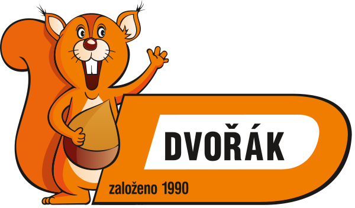

# ⚡ Elektro Dvořák - Moderní E-shop

Kompletní moderní webová stránka pro e-shop Elektro Dvořák zaměřený na prodej elektroinstalačního materiálu, LED osvětlení a příslušenství.

## 📋 Obsah

- [O projektu](#o-projektu)
- [Technologie](#technologie)
- [Struktura projektu](#struktura-projektu)
- [Funkce](#funkce)
- [Instalace a spuštění](#instalace-a-spuštění)
- [Stránky](#stránky)
- [Responzivní design](#responzivní-design)
- [Připojení k backendu](#připojení-k-backendu)
- [Budoucí rozšíření](#budoucí-rozšíření)

## 🎯 O projektu

Moderní, čistý a responzivní e-shop postavený s důrazem na:
- **Uživatelskou přívětivost** - Intuitivní navigace a přehledné rozhraní
- **Výkon** - Optimalizovaný kód, rychlé načítání
- **Moderní design** - Minimalistický styl v barvách bílá, šedá, modrá
- **Mobilní first** - Plně responzivní pro všechna zařízení
- **Profesionalita** - Vhodný pro seriózní obchodní použití

## 🛠️ Technologie

### Frontend
- **HTML5** - Sémantické značky, moderní struktura
- **CSS3** - Flexbox, Grid, CSS Variables, animace
- **JavaScript (ES6+)** - Objektově orientovaný přístup, ES6+ syntax

### Bez závislostí
Projekt je vytvořen bez použití externích knihoven pro maximální rychlost a snadnou údržbu. Vše je postaveno na čistém HTML, CSS a JavaScriptu.

## 📁 Struktura projektu

```
web-development/
│
├── index.html                  # Hlavní stránka
│
├── pages/                      # Podstránky
│   ├── about.html             # O nás
│   ├── categories.html        # Produkty s filtry
│   ├── product.html           # Detail produktu
│   ├── cart.html              # Nákupní košík
│   └── contact.html           # Kontakt
│
├── assets/                     # Statické soubory
│   ├── css/
│   │   └── style.css          # Hlavní stylesheet
│   │
│   ├── js/
│   │   └── script.js          # Hlavní JavaScript
│   │
│   ├── images/                # Obrázky produktů
│   └── icons/                 # Ikony a favicon
│
└── README.md                   # Dokumentace
```

## ✨ Funkce

### Hlavní funkce
- ✅ **Responzivní design** - Mobilní, tablet, desktop
- ✅ **Fixed header** - Vždy přístupná navigace
- ✅ **Nákupní košík** - LocalStorage persistence
- ✅ **Filtry produktů** - Kategorie, cena, výrobce
- ✅ **Třídění** - Podle ceny, názvu, novinek
- ✅ **Vyhledávání** - Real-time vyhledávání
- ✅ **Galerie produktu** - Náhledy obrázků
- ✅ **Hodnocení** - Zobrazení hodnocení zákazníků
- ✅ **Kontaktní formulář** - S validací
- ✅ **Smooth scroll** - Plynulé přechody
- ✅ **Animace** - Fade-in efekty při scrollování

### JavaScript komponenty

#### 1. ShoppingCart
Správa nákupního košíku s localStorage persistencí.
```javascript
// Přidání do košíku
cart.addToCart(productCard);

// Aktualizace množství
cart.updateQuantity(productId, quantity);

// Odstranění položky
cart.removeFromCart(productId);

// Získání celkové ceny
const total = cart.getTotal();
```

#### 2. ProductFilters
Filtrování produktů podle kategorie, ceny, výrobce.
```javascript
// Filtry se aplikují automaticky při změně
const filters = new ProductFilters();
```

#### 3. ProductSorter
Třídění produktů podle různých kritérií.
```javascript
// Třídění podle ceny vzestupně
sorter.sortProducts('price-asc');
```

#### 4. ContactForm
Validace a odeslání kontaktního formuláře.
```javascript
// Automatická validace při odeslání
const form = new ContactForm();
```

## 🚀 Instalace a spuštění

### Lokální spuštění

1. **Stažení projektu**
```bash
git clone <repository-url>
cd web-development
```

2. **Spuštění webového serveru**

   **Varianta A - Python**
   ```bash
   # Python 3
   python -m http.server 8000
   ```

   **Varianta B - Node.js**
   ```bash
   npx http-server -p 8000
   ```

   **Varianta C - PHP**
   ```bash
   php -S localhost:8000
   ```

3. **Otevření v prohlížeči**
   ```
   http://localhost:8000
   ```

### Nasazení na hosting

1. **Nahrajte všechny soubory** do kořenového adresáře vašeho hostingu
2. **Nastavte index.html** jako výchozí stránku
3. **Ověřte cesty** k CSS a JS souborům

## 📄 Stránky

### 1. Homepage (index.html)
- Hero sekce s CTA tlačítky
- Výhody nákupu (4 karty)
- Kategorie produktů (6 kategorií)
- Doporučené produkty
- Nejprodávanější produkty
- O společnosti (krátká sekce)

### 2. Produkty (pages/categories.html)
- Sidebar s filtry:
  - Vyhledávání
  - Kategorie
  - Cenové rozmezí
  - Výrobce
  - Dostupnost
- Grid/List view
- Třídění produktů
- Stránkování
- 12+ produktů

### 3. Detail produktu (pages/product.html)
- Galerie obrázků s náhledy
- Název, cena, dostupnost
- SKU a hodnocení
- Výběr množství
- Přidání do košíku
- Taby:
  - Popis produktu
  - Technické parametry
  - Hodnocení zákazníků
- Související produkty

### 4. Košík (pages/cart.html)
- Seznam položek v košíku
- Úprava množství
- Odstranění položek
- Výběr dopravy
- Slevový kód
- Souhrn objednávky
- Přechod na pokladnu

### 5. O nás (pages/about.html)
- Hero sekce
- Historie firmy
- Statistiky (4 metriky)
- Timeline vývoje
- Hodnoty společnosti
- Náš tým
- Partneři
- CTA sekce

### 6. Kontakt (pages/contact.html)
- Kontaktní údaje (4 karty)
- Kontaktní formulář s validací
- Otevírací doba
- Mapa (placeholder)
- Dopravní dostupnost

## 📱 Responzivní design

### Breakpointy

```css
/* Desktop (default) */
@media (min-width: 993px) { ... }

/* Tablet */
@media (max-width: 992px) { ... }

/* Mobile landscape */
@media (max-width: 768px) { ... }

/* Mobile portrait */
@media (max-width: 576px) { ... }
```

### Optimalizace pro mobily
- Hamburger menu na mobilech
- Responzivní grid systém
- Touch-friendly tlačítka (min. 44×44px)
- Optimalizované velikosti písma
- Mobilní navigace

## 🔌 Připojení k backendu

Web je připraven pro snadné napojení na backend systém:

### WooCommerce (WordPress)
```javascript
// V script.js nahraďte mock data API voláními
async function fetchProducts() {
    const response = await fetch('/wp-json/wc/v3/products');
    return await response.json();
}
```

### Shoptet API
```javascript
async function fetchProducts() {
    const response = await fetch('https://api.shoptet.cz/api/products');
    return await response.json();
}
```

### Vlastní REST API
```javascript
// Upravte třídy v script.js
class ShoppingCart {
    async addToCart(product) {
        await fetch('/api/cart', {
            method: 'POST',
            body: JSON.stringify(product)
        });
    }
}
```

### Databáze
Pro produkční použití doporučujeme:
- **MySQL/PostgreSQL** pro produkty a objednávky
- **Redis** pro cache a session
- **Elasticsearch** pro vyhledávání

## 🎨 Přizpůsobení designu

### Změna barev
Upravte CSS proměnné v `assets/css/style.css`:

```css
:root {
    --primary-color: #1e5fa8;      /* Hlavní modrá */
    --primary-dark: #164779;       /* Tmavší modrá */
    --primary-light: #3b7bc4;      /* Světlejší modrá */
    --accent-color: #ff6b35;       /* Akcentová barva */
}
```

### Změna písma
```css
body {
    font-family: 'Vaše oblíbené písmo', sans-serif;
}
```

### Přidání loga
1. Připravte logo ve formátu PNG/SVG
2. Nahrajte do `assets/images/logo.png`
3. Upravte HTML:

```html
<a href="index.html" class="logo">
    
</a>
```

## 🔄 Budoucí rozšíření

### Doporučené funkce pro produkční verzi

1. **Uživatelské účty**
   - Registrace a přihlášení
   - Historie objednávek
   - Wishlist (seznam přání)
   - Hodnocení produktů

2. **Pokročilý košík**
   - Multi-step checkout
   - Platební brána integrace
   - Výpočet dopravy
   - DPH kalkulace

3. **Administrace**
   - Admin panel pro správu produktů
   - Správa objednávek
   - Statistiky prodeje
   - CMS pro editaci obsahu

4. **SEO optimalizace**
   - Meta tagy pro každou stránku
   - OpenGraph tagy
   - Schema.org markup
   - Sitemap.xml

5. **Výkon**
   - Lazy loading obrázků
   - Code splitting
   - CDN pro statické soubory
   - Komprese a minifikace

6. **Analytics**
   - Google Analytics 4
   - Facebook Pixel
   - Conversion tracking
   - Heat mapy

7. **Marketing**
   - Newsletter
   - Slevové kupóny
   - Flash sales
   - Related products AI

## 🧪 Testování

### Manuální testování
- ✅ Všechny odkazy fungují
- ✅ Formuláře se validují
- ✅ Košík ukládá data
- ✅ Responzivní na všech zařízeních
- ✅ Cross-browser kompatibilita

### Doporučené nástroje
- **Chrome DevTools** - Debugging
- **Lighthouse** - Výkon a SEO
- **BrowserStack** - Cross-browser testing
- **GTmetrix** - Rychlost webu

## 📞 Podpora

Pro otázky nebo problémy:
- Email: info@elektrodvorak.cz
- Telefon: +420 234 567 890

## 📝 Licence

© 2024 Elektro Dvořák. Všechna práva vyhrazena.

---

## 🎉 Hotovo!

Web je připraven k použití. Stačí:
1. Přidat reálné produkty a obrázky
2. Napojit na backend/CMS
3. Nastavit platební bránu
4. Nasadit na hosting

**Hodně štěstí s novým e-shopem! ⚡**
